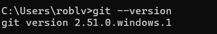
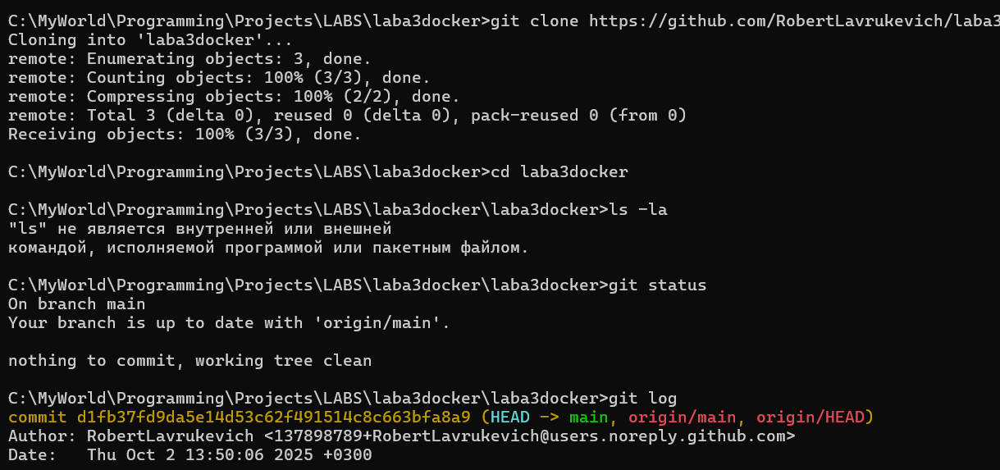
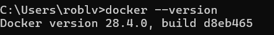
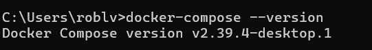
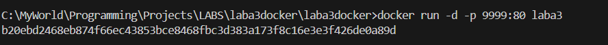
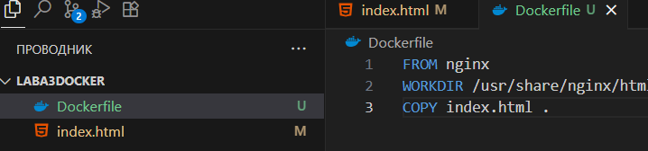

Practical Work 2, 3, 4
Выполненные шаги:
1. Установка Git
Установлена версия: 
2. Скачивание репозитория
Репозиторий склонирован: 
Содержимое: HTML файл с "GRSU Lavrukevich"
3. Установка Docker
Установлена версия: 
4. Установка Docker Compose
Установлена версия: 
5. Запуск Nginx контейнера
Собран контейнер: 
Запущен контейнер: 
HTML файл скопирован в контейнер, cтраница изменена на "GRSU Lavrukevich": 
Проверка в браузере: http://localhost:9999
6. Создан README.md
Файл с описанием работы
9. Git workflow
Создана ветка develop
Изменения закоммичены и запушены