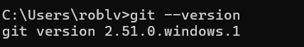
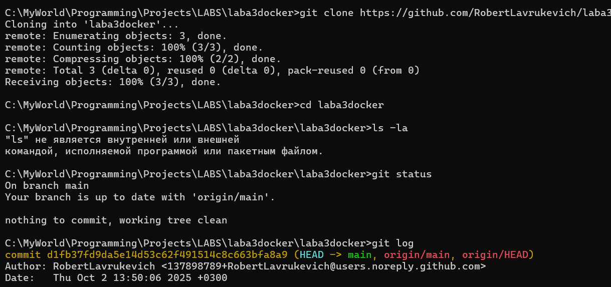
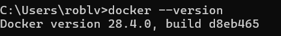
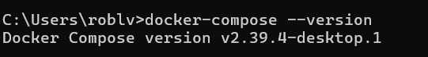
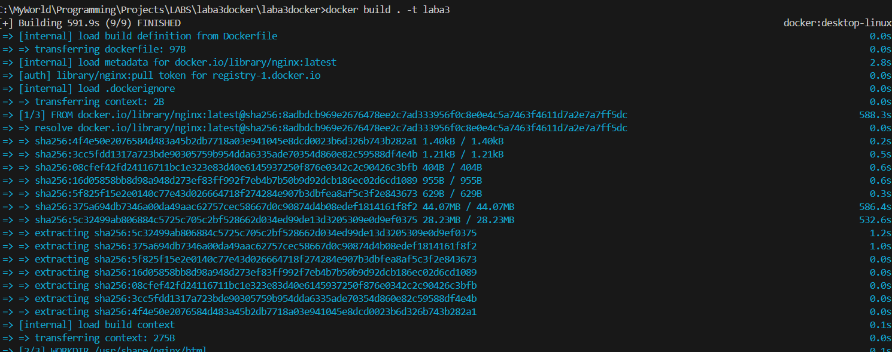
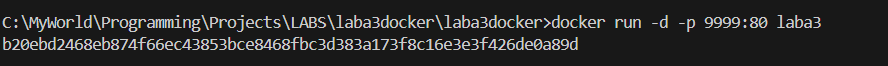

Practical Work 2, 3, 4
Выполненные шаги:
1. Установка Git
Установлена версия:
 
3. Скачивание репозитория
Репозиторий склонирован:
 
Содержимое: HTML файл с "GRSU Lavrukevich"
5. Установка Docker
Установлена версия:
 
7. Установка Docker Compose
Установлена версия:

9. Запуск Nginx контейнера
Собран контейнер:

Запущен контейнер:
 
HTML файл скопирован в контейнер, cтраница изменена на "GRSU Lavrukevich":

Проверка в браузере: http://localhost:9999
11. Создан README.md
Файл с описанием работы
12. Git workflow
Создана ветка develop
Изменения закоммичены и запушены
